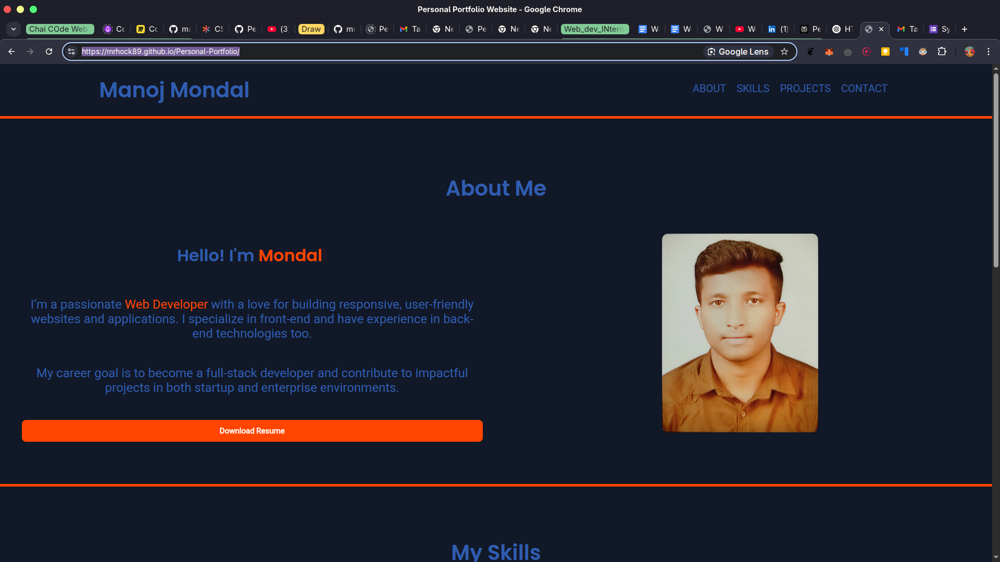
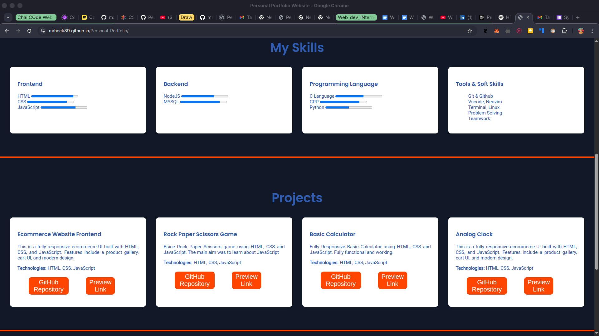
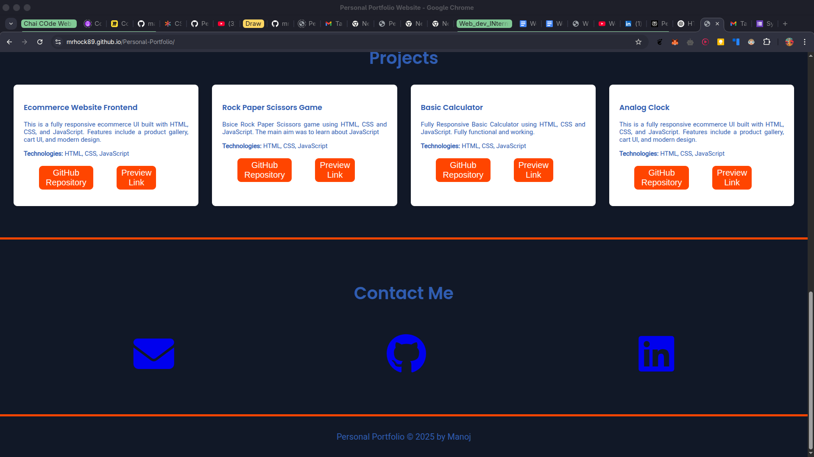
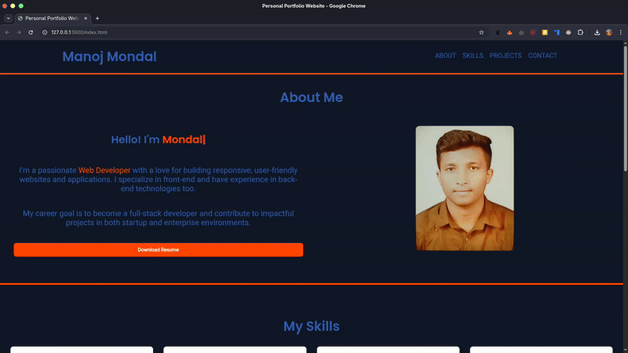
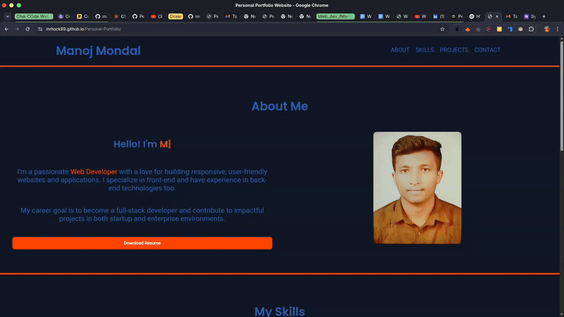

# 💼 Personal Portfolio | Task 01

This is my personal portfolio website built as part of **Task 01**. It showcases my skills, projects, and contact details in a clean, responsive, and interactive format.

---

## 🚀 Live Demo

🔗 [View Live Portfolio](https://mrhock89.github.io/Personal-Portfolio/)

---

## 🛠️ Technologies Used

- **HTML5** – Markup language for the structure of the website
- **CSS3** – For layout, styling, and responsive design
- **JavaScript** – Adds interactivity to elements like profile hover effects and dynamic typing
- **Typed.js** – A JavaScript library for beautiful typing animations
- **Font Awesome** – Icon set used across the website for social links and sections

---

## ✨ Features

- 🔥 Fully **Responsive Design** – Works seamlessly across desktop, tablet, and mobile devices
- 🙋‍♂️ **About Section** – Short introduction and personal background
- 🧠 **Skills Section** – Lists the tec

---

## 📸 Screenshots

---
---
## 📹 Demo

---