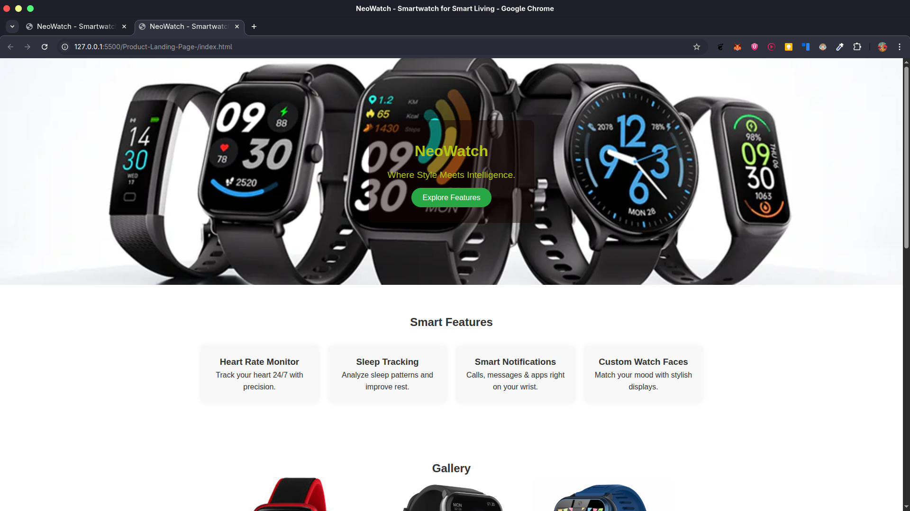
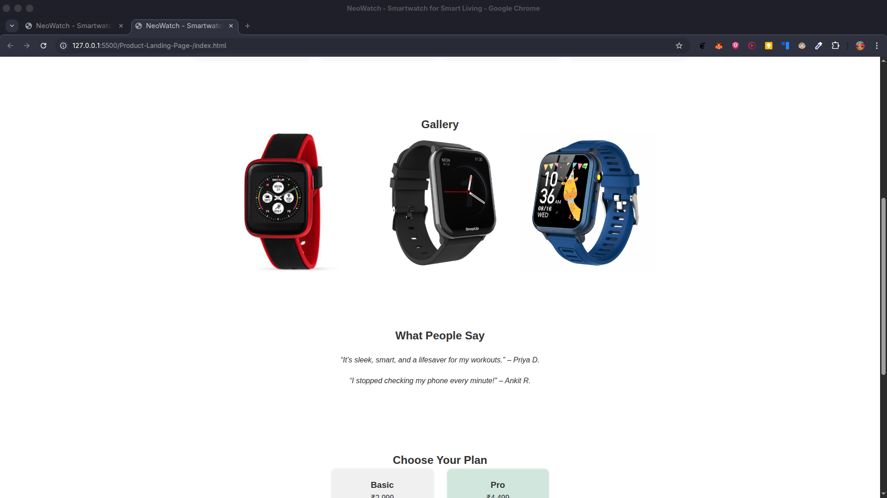
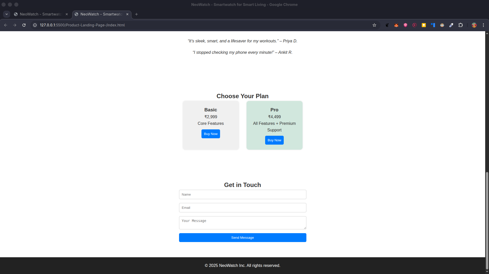

---
# Product-Landing-Page
This Repo is for my project of Product landing page. This is a simple a smart watch landing page using HTML CSS AND JavaScript.
---
---
# Features
- Hero Section
- Features Section
- Gallery/Images
- Testimonials or Pricing 
- Contact Form
- Call to Action
---
---
# Demo:
## ScreenShots





---
---
## 🛠️ Technologies Used

- **HTML5** – Markup structure
- **CSS3** – Styling and responsive design
- **JavaScript** – Interactivity and task management
---
---
## 📋 How to use this app locally

### 1. Clone the repository

```bash
git clone https://github.com/mrHock89/Product-Landing-Page-.git
cd Product-Landing-Page-
```
### 2. Open the App 

####  **🐧 ON LINUX**
```bash
xdg-open index.html
```

#### **ON MacOS**
```bash
open index.html 
```
#### **ON Windows**
```bash
start index.html 
```