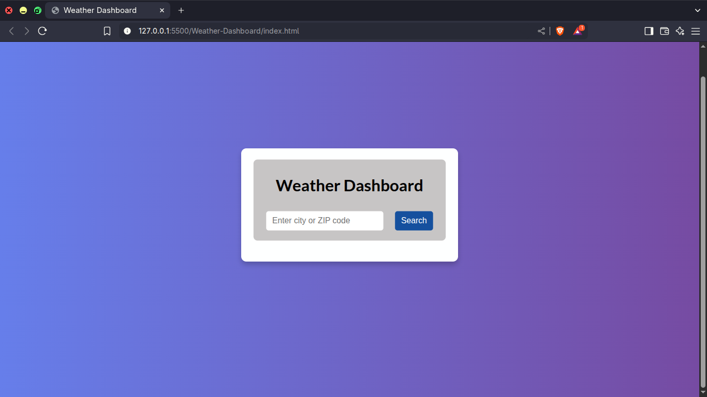
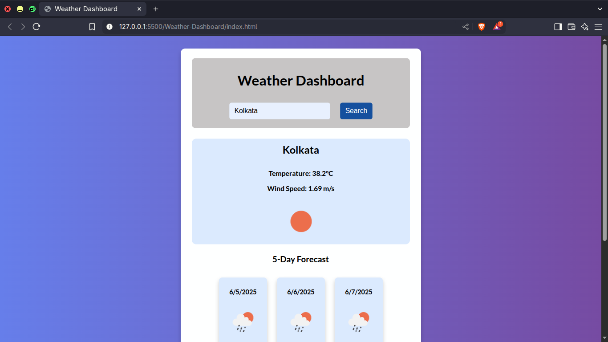
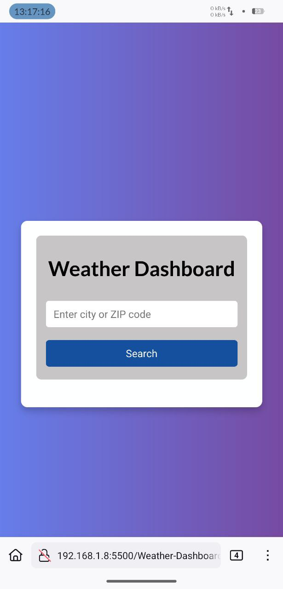
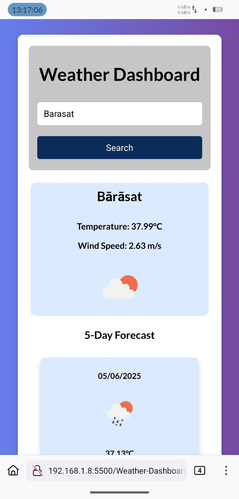

# 🌦️ Weather Dashboard

A responsive weather dashboard web application built using **HTML**, **CSS**, and **JavaScript**. It uses the **OpenWeatherMap API** to fetch and display real-time weather conditions based on the city name or ZIP code.

---
## 🔗 Live Demo

> https://mrhock89.github.io/Weather-Dashboard/

---
---
## 📸 Preview

### ScreenShots
### Desktop



### Mobile





---

## 🚀 Features

- Search weather by city name or ZIP code
- Display current temperature, wind speed, and weather icon
- 5-day forecast with weather icons and temperatures
- Fully responsive design for mobile, tablet, and desktop
- Clean UI/UX with modern color palette and hover effects
- API integration using [OpenWeatherMap](https://openweathermap.org/)

---

## 🛠️ Tech Stack

- **HTML5**
- **CSS3**
- **JavaScript ES6**
- **OpenWeatherMap API**
---

---
## 🔧 Setup Instructions

1. **Clone the repository**:
   ```bash
   git clone https://github.com/your-username/Weather-Dashboard.git
   cd Weather-Dashboard

2. Add your OpenWeatherMap API key in script.js:
    ```js
    const myapiKey = 'YOUR_API_KEY_HERE';
---

